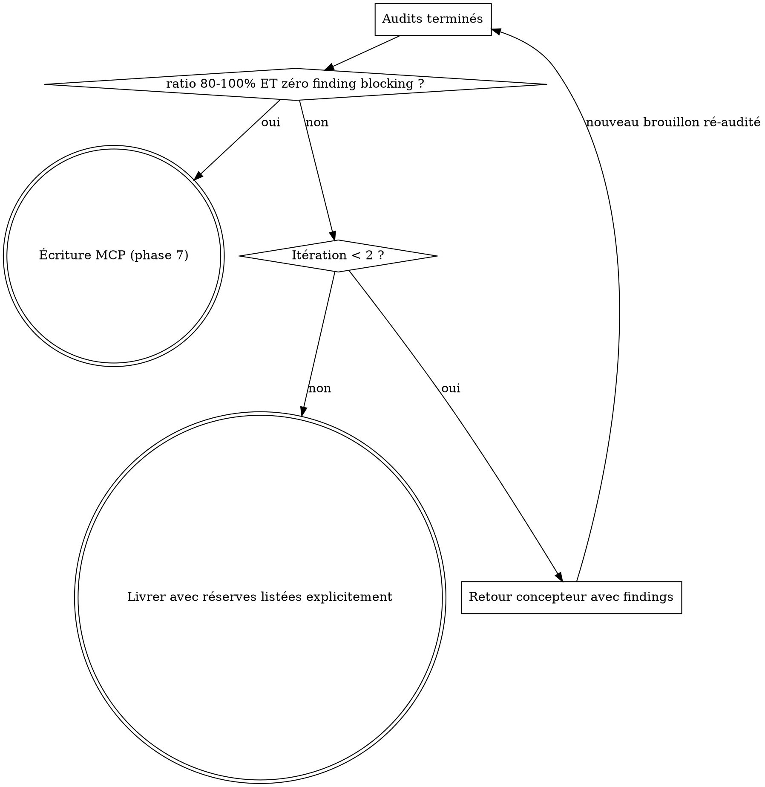

# Skill — Rédaction de contenus pédagogiques IUT

**Violer la lettre du pipeline, c'est violer son esprit.** L'écriture directe « pour
aller vite » est la cause historique des TP sous-dimensionnés et des consignes floues.
Les 8 phases sont toutes obligatoires, dans l'ordre.

## Invocation

| Commande | Comportement |
|----------|--------------|
| `/pedagogy:write` | Demande le type (Cours / TP / Slide / Examen) |
| `/pedagogy:write <type> [module] [section]` | Type (et cible) précisés directement |

## Références de contenu (source de vérité unique)

Lire avec l'outil Read selon le type — ne jamais recopier ces règles ici :

- Cours → `skills/pedagogie/references/cours.md`
- TP → `skills/pedagogie/references/tp.md`
- Slide → `skills/pedagogie/references/slide.md`
- Examen → `skills/pedagogie/references/examen.md`

Rôles : `skills/pedagogie/agents/concepteur.md`, `auditeur-apprenant.md`,
`garant-coherence.md`.

## Pipeline

### Phase 1 — Cadrage
Type de contenu + module/section cibles (args ou questions à l'utilisateur).

### Phase 2 — Collecte MCP
1. `list_modules()` → `sessionDurationMinutes`, `isExtra`, `universe` du module.
2. `list_sections(module)` → `totalDuration`, objectifs de la section.
3. `get_content(module, section, type)` pour chaque support existant de la section.
4. Si `universe.scope === "module"` : lire les TP des sections précédentes pour
   reconstruire l'état du fil rouge (fichiers, classes, fonctions, données en place).
5. Calculer le budget TP : `totalDuration × sessionDurationMinutes − temps de cours`
   (nb blocs `slide` × 2 min, forfait 30 min si pas de slides).
6. `universe` absent → demander à l'utilisateur et proposer `edit_module`.

**Serveur MCP indisponible ou non connecté → STOP.** Afficher : « Connexion MCP
requise (cours-iut-web ou cours-iut-staging) — je ne génère jamais sans contexte. »

### Phase 3 — Contrat d'entrée
Remplir le contrat YAML du document `main` du skill pédagogie
(`skills/pedagogie/SKILL.md`), complété avec : budget chiffré en minutes, `universe`,
état du fil rouge. Champs inconnus = « indisponible », jamais inventés.

### Phase 4 — Conception (sous-agent concepteur)
Dispatcher un sous-agent Task avec : le contenu de
`skills/pedagogie/agents/concepteur.md` + le contrat d'entrée + la référence du type.
Sortie attendue : carte d'alignement + squelette chiffré (TP) + brouillon complet
en blocs (types validés contre `list_block_types()`).

### Phase 5 — Audits (sous-agents parallèles)
- **Toujours** : auditeur-apprenant (`skills/pedagogie/agents/auditeur-apprenant.md`)
  → findings YAML + `time_audit` + tests de démarrage.
- **Si fil rouge annuel (`universe.scope === "module"`) ou modification
  structurante** : garant-cohérence (`skills/pedagogie/agents/garant-coherence.md`).

Les deux audits reçoivent le brouillon complet + le contrat d'entrée.

### Phase 6 — Consolidation + boucle calibrage

Arbitrer les findings avec le format `decision` du document `main`. Ne jamais
appliquer une recommandation qui crée une incohérence détectée par le garant.

### Phase 7 — Écriture MCP
Seulement après consolidation : `list_block_types()` puis `save_content` /
`insert_block` / `edit_block`. Jamais de type ou de prop devinés.

### Phase 8 — Vérification
Relire via `get_content` et vérifier que chaque bloc écrit correspond au contenu
consolidé. Signaler tout écart.

## Red flags — STOP immédiat

- Écrire des blocs avant la consolidation de la phase 6
- Deviner un type de bloc sans `list_block_types()`
- Sauter l'auditeur-apprenant (quelle que soit la taille du contenu)
- Générer sans collecte MCP (phase 2)
- Livrer un TP hors 80–100 % du budget sans le signaler explicitement

## Excuses connues

| Excuse | Réalité |
|--------|---------|
| « C'est un petit TP, pas besoin d'audit » | Les TP courts sont précisément ceux qui sortaient sous-dimensionnés. |
| « Je connais déjà les types de blocs » | Le schéma évolue ; un type deviné casse le renderer. |
| « Une itération suffit, le budget est approximatif » | Le `time_audit` chiffré de l'auditeur décide, pas l'intuition. |
| « L'utilisateur est pressé, j'écris directement » | Le pipeline existe parce que l'écriture directe produisait du contenu inutilisable. |
