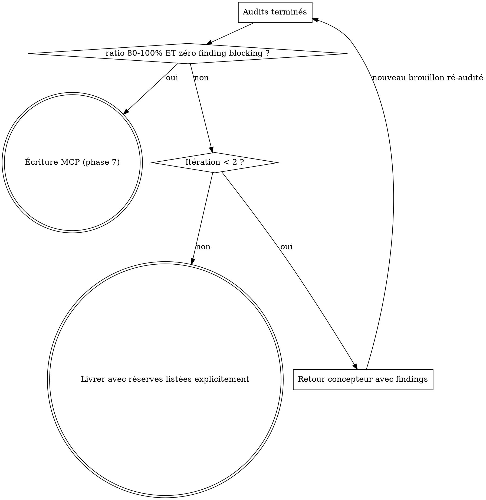

# Refonte /pedagogy:write + boucle review/rewrite/sync — Implementation Plan

> **For agentic workers:** REQUIRED SUB-SKILL: Use superpowers:subagent-driven-development (recommended) or superpowers:executing-plans to implement this plan task-by-task. Steps use checkbox (`- [ ]`) syntax for tracking.

**Goal:** Reconstruire `/pedagogy:write` en pipeline orchestré (contexte MCP → conception → audits → calibrage → blocs) et aligner review/rewrite/sync sur MCP, avec un champ `universe` par module en DB.

**Architecture:** Le pipeline vit dans `.claude/skills/pedagogy-write/SKILL.md` (spécifique Claude Code) ; toutes les règles de contenu vivent dans `skills/pedagogie/` (références + rôles, servies aussi via MCP après `bun run generate-skill`). Le champ `universe` suit exactement le chemin de `sessionDurationMinutes` (type → schema Zod → MCP → admin). Spec : `docs/superpowers/specs/2026-07-08-pedagogy-write-refonte-design.md`.

**Tech Stack:** Next.js 16 App Router, MongoDB driver, Zod, `bun test`, skills markdown.

---

## File Structure

| Fichier | Action | Responsabilité |
|---------|--------|----------------|
| `src/lib/schemas/module.schema.ts` | Modify | `universeSchema` + champ `universe` dans `moduleFormSchema` |
| `src/lib/schemas/module.schema.test.ts` | Create | Tests Zod du champ `universe` |
| `src/types/Module.ts` | Modify | Interface `ModuleUniverse` + champ `universe` |
| `src/app/api/mcp/route.ts` | Modify | `universe` dans `create_module`, `edit_module`, `list_modules`, `ModuleDoc` |
| `src/components/admin/EditModuleSheet.tsx` | Modify | Section « Univers thématique » du formulaire |
| `skills/pedagogie/references/tp.md` | Rewrite | Contrat de consigne universel, grille de durées, univers |
| `skills/pedagogie/references/cours.md` | Modify | Exemples ancrés dans l'univers |
| `skills/pedagogie/agents/concepteur.md` | Modify | Dimensionnement temporel chiffré |
| `skills/pedagogie/agents/auditeur-apprenant.md` | Modify | Simulation temporelle + test de démarrage |
| `.claude/skills/pedagogy-write/SKILL.md` | Rewrite | Pipeline 8 phases + garde-fous |
| `.claude/skills/pedagogy-review/SKILL.md` | Rewrite | Collecte MCP + rôles chargés depuis `skills/pedagogie/agents/` |
| `.claude/skills/pedagogy-rewrite/SKILL.md` | Rewrite | Corrections via blocs MCP |
| `.claude/skills/pedagogy-sync/SKILL.md` | Rewrite | Extraction curriculum depuis les blocs DB |
| `.claude/skills/pedagogy/reference/` | Delete | Doublon périmé, plus référencé nulle part |
| `docs/superpowers/baselines/2026-07-08-pedagogy-write-baseline.md` | Create | Baseline RED chiffrée |

Rappel : `src/lib/skills/pedagogie.ts` est **généré** par `bun run generate-skill` — jamais d'édition manuelle ; le régénérer et le committer à chaque modification de `skills/pedagogie/`.

---

### Task 1: Baseline RED (avant toute modification)

**Files:**
- Create: `docs/superpowers/baselines/2026-07-08-pedagogy-write-baseline.md`

Cette tâche nécessite la connexion MCP `cours-iut-staging`. **Si elle n'est pas disponible dans la session d'exécution, sauter la tâche** et noter dans le plan qu'elle devra être rejouée depuis git (`git show 1454c42:.claude/skills/pedagogy-write/SKILL.md` donne le skill d'origine).

- [ ] **Step 1: Générer un TP avec le skill actuel**

Suivre `.claude/skills/pedagogy-write/SKILL.md` tel qu'il existe (avant refonte) pour générer un TP sur un module/section de staging (choisir une section existante sans TP, ex. via `list_modules` + `list_sections`). Ne PAS sauvegarder le résultat en DB — garder le contenu produit en local.

- [ ] **Step 2: Mesurer et archiver la baseline**

Écrire `docs/superpowers/baselines/2026-07-08-pedagogy-write-baseline.md` :

```markdown
# Baseline RED — /pedagogy:write avant refonte — 2026-07-08

Scénario : module=<slug>, section=<slug>, consigne="génère le TP de cette section"

## Métriques
- Budget de la séance : <totalDuration × sessionDurationMinutes> min
- Durée totale estimée du TP produit : <N> min (<ratio> % du budget)
- Exercices sans fichier cible : <n>/<total>
- Exercices sans résultat observable décrit : <n>/<total>
- Exercices sans critère de validation : <n>/<total>
- Exemples/données jouets ou hors univers : <n>

## Contenu produit (verbatim)
<le TP généré>
```

- [ ] **Step 3: Commit**

```powershell
git add docs/superpowers/baselines/2026-07-08-pedagogy-write-baseline.md
git commit -m "test(pedagogy): baseline RED du skill write avant refonte"
```

---

### Task 2: Schéma Zod + type `universe` (TDD)

**Files:**
- Create: `src/lib/schemas/module.schema.test.ts`
- Modify: `src/lib/schemas/module.schema.ts:30-48`
- Modify: `src/types/Module.ts`

- [ ] **Step 1: Write the failing test**

Créer `src/lib/schemas/module.schema.test.ts` :

```ts
import {describe, expect, test} from "bun:test";
import {moduleFormSchema, universeSchema} from "@/lib/schemas/module.schema";

const baseModule = {
    title: "PHP",
    path: "php",
    iconName: "Code",
    associatedSae: [],
    coefficients: [],
    instructors: [],
};

describe("universeSchema", () => {
    test("accepte un univers complet", () => {
        const r = universeSchema.safeParse({
            name: "Netflex",
            description: "Catalogue de films : title, year, genre, rating",
            scope: "module",
        });
        expect(r.success).toBe(true);
    });

    test("rejette un scope inconnu", () => {
        const r = universeSchema.safeParse({
            name: "Netflex",
            description: "Catalogue de films",
            scope: "annuel",
        });
        expect(r.success).toBe(false);
    });

    test("rejette un nom vide", () => {
        const r = universeSchema.safeParse({
            name: "",
            description: "Catalogue de films",
            scope: "tp",
        });
        expect(r.success).toBe(false);
    });
});

describe("moduleFormSchema.universe", () => {
    test("universe est optionnel", () => {
        const r = moduleFormSchema.safeParse(baseModule);
        expect(r.success).toBe(true);
    });

    test("accepte un module avec universe", () => {
        const r = moduleFormSchema.safeParse({
            ...baseModule,
            universe: {name: "Netflex", description: "Films", scope: "module"},
        });
        expect(r.success).toBe(true);
        if (r.success) expect(r.data.universe?.scope).toBe("module");
    });
});
```

- [ ] **Step 2: Run test to verify it fails**

Run: `bun test src/lib/schemas/module.schema.test.ts`
Expected: FAIL — `universeSchema` n'est pas exporté.

- [ ] **Step 3: Write minimal implementation**

Dans `src/lib/schemas/module.schema.ts`, après `hexColorSchema` :

```ts
export const universeSchema = z.object({
    name: z.string().min(1, "Le nom de l'univers est obligatoire"),
    description: z.string().min(1, "La description de l'univers est obligatoire"),
    scope: z.enum(["module", "tp"]),
});
```

Dans `moduleFormSchema`, après `sessionDurationMinutes` :

```ts
    universe: universeSchema.optional(),
```

Dans `src/types/Module.ts`, avant l'interface `Module` :

```ts
export interface ModuleUniverse {
    name: string;
    description: string;
    scope: "module" | "tp";
}
```

et dans l'interface `Module`, après `sessionDurationMinutes?: number;` :

```ts
    universe?: ModuleUniverse;
```

- [ ] **Step 4: Run test to verify it passes**

Run: `bun test src/lib/schemas/module.schema.test.ts`
Expected: PASS (5 tests).

- [ ] **Step 5: Commit**

```powershell
git add src/lib/schemas/module.schema.ts src/lib/schemas/module.schema.test.ts src/types/Module.ts
git commit -m "feat(module): champ universe {name, description, scope} sur Module"
```

---

### Task 3: MCP — `universe` dans create_module / edit_module / list_modules

**Files:**
- Modify: `src/app/api/mcp/route.ts` (interface `ModuleDoc` ~l.64, `create_module` ~l.380, `edit_module` ~l.437, `list_modules` ~l.678)

- [ ] **Step 1: Importer `universeSchema`**

Ligne 17, remplacer :

```ts
import { moduleFormSchema } from "@/lib/schemas/module.schema";
```

par :

```ts
import { moduleFormSchema, universeSchema } from "@/lib/schemas/module.schema";
```

- [ ] **Step 2: Étendre `ModuleDoc`**

Dans l'interface `ModuleDoc` (~l.64), après `sessionDurationMinutes?: number;` :

```ts
    universe?: { name: string; description: string; scope: "module" | "tp" };
```

- [ ] **Step 3: `create_module` accepte `universe`**

Dans les params du tool (~l.387), après `sessionDurationMinutes` :

```ts
            universe: universeSchema.optional()
                .describe("Univers thématique du module : name (ex: Netflex), description (domaine + données types), scope ('module' = fil rouge annuel, 'tp' = livrable par TP)"),
```

Ajouter `universe` à la destructuration du handler (~l.390) et à l'objet passé à `moduleFormSchema.safeParse` (~l.409, après `sessionDurationMinutes,`) :

```ts
                universe,
```

(l'`insertOne({ ...parsed.data, ... })` propage le champ automatiquement.)

- [ ] **Step 4: `edit_module` accepte `universe`**

Description du tool (~l.439) : ajouter `universe` à la liste des champs éditables.
Params (~l.449), après `sessionDurationMinutes` :

```ts
            universe: universeSchema.optional()
                .describe("Univers thématique : name, description (domaine + données types), scope ('module' = fil rouge annuel, 'tp' = livrable par TP)"),
```

Destructuration du handler (~l.452) : ajouter `universe`. Dans le bloc des `set` (~l.465) :

```ts
            if (universe !== undefined) set.universe = universe;
```

- [ ] **Step 5: `list_modules` expose `universe`**

Remplacer (~l.684-692) le type inline, la projection et le mapping :

```ts
            const modules = await db.collection<{ path: string; title?: string; isExtra?: boolean; sessionDurationMinutes?: number; universe?: { name: string; description: string; scope: "module" | "tp" } }>("modules")
                .find({}, { projection: { path: 1, title: 1, isExtra: 1, sessionDurationMinutes: 1, universe: 1, _id: 0 } })
                .toArray();
            const result = modules.map((m) => ({
                slug: m.path,
                title: m.title ?? m.path,
                isExtra: m.isExtra ?? false,
                ...(m.sessionDurationMinutes !== undefined && { sessionDurationMinutes: m.sessionDurationMinutes }),
                ...(m.universe !== undefined && { universe: m.universe }),
            }));
```

- [ ] **Step 6: Vérifier la compilation**

Run: `bun run build`
Expected: build OK (le prebuild régénère aussi `src/lib/skills/pedagogie.ts` — ne committer que s'il a changé).

- [ ] **Step 7: Commit**

```powershell
git add src/app/api/mcp/route.ts
git commit -m "feat(mcp): universe exposé dans create_module, edit_module et list_modules"
```

---

### Task 4: Admin — section « Univers thématique » dans EditModuleSheet

**Files:**
- Modify: `src/components/admin/EditModuleSheet.tsx` (defaults ~l.38-55, JSX après la section Identification ~l.164)

Le PUT `src/app/api/admin/modules/[moduleId]/route.ts` fait `$set: parsed.data` sur le `moduleFormSchema` : aucun changement serveur nécessaire.

- [ ] **Step 1: Défauts du formulaire**

Dans `getDefaultValues()`, après `isExtra: module.isExtra ?? false,` :

```ts
        universe: module.universe,
```

Attention : `universe` absent doit rester `undefined` (pas d'objet aux champs vides, sinon le Zod `min(1)` rejette la soumission d'un module sans univers).

- [ ] **Step 2: UI de saisie**

Après la fermeture de la section Identification (`</section>` ~l.164) et le séparateur, insérer une nouvelle section. Utiliser `watch`/`setValue` du `useForm` existant (ajouter `watch` et `setValue` à la destructuration l.57-63) :

```tsx
                        <div className="h-px bg-bridge-700/20 dark:bg-bridge-500/20 -mx-6"/>

                        {/* Univers thématique */}
                        <section className="flex flex-col gap-3">
                            <Eyebrow>Univers thématique</Eyebrow>
                            <label className="flex items-center gap-2 cursor-pointer">
                                <Checkbox
                                    checked={watch('universe') !== undefined}
                                    onCheckedChange={(checked) => setValue('universe', checked
                                        ? {name: '', description: '', scope: 'tp'}
                                        : undefined)}
                                />
                                <span className="text-sm text-brand-dark dark:text-bridge-100">Définir un univers</span>
                            </label>
                            {watch('universe') !== undefined && (
                                <>
                                    <div>
                                        <Label htmlFor="em-universe-name" className={labelCn}>Nom *</Label>
                                        <Input id="em-universe-name" className={inputCn} placeholder="Netflex"
                                            {...register('universe.name')}/>
                                        {errors.universe?.name && (
                                            <p className="text-red-500 text-xs mt-1">{errors.universe.name.message}</p>
                                        )}
                                    </div>
                                    <div>
                                        <Label htmlFor="em-universe-desc" className={labelCn}>Description (domaine + données types) *</Label>
                                        <Textarea id="em-universe-desc" rows={3} className={inputCn}
                                            placeholder="Catalogue de films : title, year, genre, rating…"
                                            {...register('universe.description')}/>
                                        {errors.universe?.description && (
                                            <p className="text-red-500 text-xs mt-1">{errors.universe.description.message}</p>
                                        )}
                                    </div>
                                    <Controller
                                        control={control}
                                        name="universe.scope"
                                        render={({field}) => (
                                            <div className="flex gap-6">
                                                <label className="flex items-center gap-2 cursor-pointer">
                                                    <Checkbox checked={field.value === 'module'}
                                                        onCheckedChange={() => field.onChange('module')}/>
                                                    <span className="text-sm text-brand-dark dark:text-bridge-100">Fil rouge annuel</span>
                                                </label>
                                                <label className="flex items-center gap-2 cursor-pointer">
                                                    <Checkbox checked={field.value === 'tp'}
                                                        onCheckedChange={() => field.onChange('tp')}/>
                                                    <span className="text-sm text-brand-dark dark:text-bridge-100">Livrable par TP</span>
                                                </label>
                                            </div>
                                        )}
                                    />
                                </>
                            )}
                        </section>
```

- [ ] **Step 3: Vérifier lint + build**

Run: `bun run lint` puis `bun run build`
Expected: aucun nouvel avertissement, build OK.

- [ ] **Step 4: Commit**

```powershell
git add src/components/admin/EditModuleSheet.tsx
git commit -m "feat(admin): édition de l'univers thématique du module"
```

---

### Task 5: `skills/pedagogie/references/tp.md` — contrat universel, grille, univers

**Files:**
- Rewrite: `skills/pedagogie/references/tp.md`
- Regenerate: `src/lib/skills/pedagogie.ts` (via `bun run generate-skill`)

- [ ] **Step 1: Remplacer intégralement le fichier**

```markdown
# Règles pédagogiques — Type : TP

## Format d'écriture : blocs

Le TP est un arbre de blocs écrit via les outils MCP (`save_content`, `insert_block`,
`edit_block`…). Avant de rédiger, appelez `list_block_types()` pour obtenir la liste à
jour des types de blocs, leurs props exactes, les blocs conteneurs et leurs enfants
autorisés. Ne devinez jamais un type ou une prop.

Conventions d'usage pédagogique (non déductibles du schéma) :

| Usage | Bloc |
|-------|------|
| Un exercice | `section` avec `title` : « Exercice N — [objectif] » |
| Consignes pas-à-pas | `list` avec `ordered: true`, une action par `list-item` |
| Code (squelette, signature, exemple) | `code` avec `language` et `filename` — jamais de code dans un bloc `text` |
| Fichier de départ fourni | `download-file` (données réalistes de l'univers) |
| Récapitulatif d'état du projet | `callout` variant `info`, title « À ce stade, votre projet contient » |
| Avertissement / rappel | `callout` variant `warning` ou `reminder` |

## Univers du module

Chaque module déclare son univers thématique dans le champ `universe` retourné par
`list_modules()` : `name` (ex : Netflex), `description` (domaine + données types) et
`scope`.

- **Toutes** les données, exemples et livrables du TP puisent dans cet univers.
- `scope: "module"` → **fil rouge annuel** : chaque TP fait avancer le même projet
  d'une séance à l'autre. Avant d'écrire ou de réviser, reconstruire l'état courant du
  projet en lisant les TP des sections précédentes (`list_sections(module)` puis
  `get_content(module, section, "TP")`) : fichiers existants, classes et fonctions déjà
  définies, structure de base de données, fonctionnalités en place. Les exercices
  s'appuient sur cet état sans le répéter ni le contredire.
- `scope: "tp"` → **livrable par TP** : chaque TP construit un objet terminé dans
  l'univers commun, sans dépendance entre TP.
- Module sans `universe` : demander à l'utilisateur de le définir et proposer de le
  sauvegarder via `edit_module` avant de rédiger.

## Structure obligatoire du TP

1. **Annonce du livrable** — le TP s'ouvre sur un bloc `text` :
   « À la fin de ce TP, vous aurez construit **X** ». X est un objet concret et
   démontrable de l'univers du module, jamais « des exercices sur les boucles ».
2. **Exercice 1 — échauffement indépendant** — application directe de la notion du
   cours, sans lien avec le fil rouge (mais dans l'univers), démarrable même sans avoir
   tout compris. Guidage fort.
3. **Exercices 2 et suivants — fil rouge séquentiel** — chaque exercice fait avancer
   le livrable en s'appuyant sur le résultat de l'exercice précédent. Les dépendances
   entre exercices du fil rouge sont autorisées et attendues.

## Contrat de consigne universel

**Tout exercice, quel que soit son niveau de guidage**, fournit explicitement :

1. le ou les **fichiers cibles** (créés ou modifiés) ;
2. les **noms exacts** des fonctions, classes ou identifiants à créer ;
3. les **données d'entrée** (fournies via `download-file` ou définies dans l'énoncé) ;
4. le **résultat observable**, décrit précisément : sortie console verbatim,
   description du rendu visuel, valeur retournée ;
5. le **critère de validation** (« Vous devriez voir X dans la console / le
   navigateur »).

Le guidage léger retire uniquement les **étapes intermédiaires** (le « comment ») —
jamais un élément du contrat. Une consigne dont un étudiant ne peut pas déduire quel
fichier ouvrir, quoi nommer et à quoi ressemble le résultat est un constat bloquant.

## Récapitulatif d'état (filet de sécurité)

Chaque exercice du fil rouge commence par un `callout` info
« À ce stade, votre projet contient : » listant les fichiers, les fonctions ou classes
définies et les fonctionnalités en place.

- Le récapitulatif de l'exercice N décrit **exactement** le résultat attendu de
  l'exercice N−1 — ni plus, ni moins.
- Il permet à un étudiant bloqué de se resynchroniser rapidement avec l'aide de
  l'enseignant, sans maintenir de code de rattrapage.

## Schéma Définir → Utiliser

Chaque exercice suit ce schéma en deux temps :

### Étape 1 — Définir
L'étudiant crée la fonction, la classe ou le module. Imposer :
- Le **nom exact** de la fonction/classe
- Les **paramètres** et leur type attendu (en commentaire ou en description)
- Le **type de retour** attendu
- **Ne jamais donner le corps** de la fonction

### Étape 2 — Utiliser
L'étudiant appelle ce qu'il vient de créer dans un contexte réel. Imposer :
- Le **fichier cible** où l'appel doit se faire
- Le **résultat observable** attendu (affichage console, rendu visuel, valeur retournée)
- **Ne jamais donner l'appel exact**

## Guidage progressif

### Exercices 1–2 : guidage fort

- Contrat de consigne complet + **étapes numérotées** (`list` ordered)
- Méthode ou API à utiliser imposée
- Chaque action formulée à l'**impératif vouvoyé** :
  `Créez`, `Ajoutez`, `Modifiez`, `Vérifiez`, `Ouvrez`, `Utilisez`, `Affichez`
- **Jamais d'infinitif** (« Créer le fichier… ») ni de futur (« Vous créerez… »)

### Exercices 3 et suivants : guidage léger

- Contrat de consigne complet, mais **pas d'étapes numérotées** : l'étudiant détermine
  lui-même le chemin entre l'état courant et le résultat observable
- Contraintes techniques listées (ex : « sans boucle `for` », « avec la méthode
  `reduce` »)

## Anti-abstraction

- Chaque exercice manipule les **données réelles de l'univers** (des films, des scores,
  des produits…) — jamais de `foo`/`bar` ni de fonctions jouets (« une fonction qui
  additionne deux nombres »).
- Si l'exercice a besoin de données, les fournir via un bloc `download-file` avec des
  données réalistes de l'univers.

## Calibrage temporel

Budget TP = `totalDuration` (section, nb de séances) × `sessionDurationMinutes` (module)
− temps de cours en séance.

- Lire les durées via `list_modules()` (`sessionDurationMinutes`, `isExtra`,
  `universe`) et `list_sections(module)` (`totalDuration`).
- Temps de cours en séance : nombre de blocs `slide` dans
  `get_content(module, section, "slide")` × 2 minutes. Si les slides n'existent pas
  encore, déduire un forfait de 30 minutes de la première séance.

**Grille de dimensionnement a priori :**

| Type d'exercice | Durée étudiant estimée |
|-----------------|------------------------|
| Guidé (exercices 1–2) | 20–30 min |
| Léger (exercices 3+) | 40–60 min |

- Déduire le **nombre d'exercices** du budget avec cette grille.
- La somme des durées estimées doit couvrir **80 à 100 % du budget**. Un TP finissable
  en 30 minutes sur une séance de 150 minutes est un constat bloquant, au même titre
  qu'un TP infinissable.
- Chaque exercice indique une **durée indicative** ; vérifier à la rédaction que la
  somme respecte la cible.
- Modules avec `isExtra: true` (bonus à faire chez soi) : aucune contrainte de durée,
  mais le TP doit être **auto-suffisant** (réalisable sans enseignant).

## Règles absolues

- **Jamais de code solution** dans le TP, même partiel
- **Contrat de consigne complet sur tous les exercices**, y compris en guidage léger
- Le récapitulatif d'état de l'exercice N correspond exactement au résultat de N−1
- Somme des durées estimées entre 80 et 100 % du budget (hors `isExtra`)
```

- [ ] **Step 2: Régénérer le module skill**

Run: `bun run generate-skill`
Expected: `src/lib/skills/pedagogie.ts` régénéré sans erreur.

- [ ] **Step 3: Vérifier les marqueurs clés**

Run: `Select-String -Path skills/pedagogie/references/tp.md -Pattern "Contrat de consigne universel","80 à 100","universe"`
Expected: les trois motifs présents ; plus aucune occurrence de « Netflex » en dur (`Select-String -Path skills/pedagogie/references/tp.md -Pattern "Netflex"` → seulement dans l'exemple du champ, aucune règle spécifique PHP).

- [ ] **Step 4: Commit**

```powershell
git add skills/pedagogie/references/tp.md src/lib/skills/pedagogie.ts
git commit -m "feat(skill): ref-tp — contrat de consigne universel, grille de durées, univers module"
```

---

### Task 6: `skills/pedagogie/references/cours.md` — exemples ancrés dans l'univers

**Files:**
- Modify: `skills/pedagogie/references/cours.md`
- Regenerate: `src/lib/skills/pedagogie.ts`

- [ ] **Step 1: Remplacer la section « Structure imposée pour chaque concept »**

Remplacer les items 3–5 de la liste par :

```markdown
3. **Exemple minimal** — le cas le plus simple possible, avec des données de
   l'univers du module (bloc `code`)
4. **Exemple réaliste** — variante complète et utile du même exemple, toujours dans
   l'univers, montrant la notion « en situation » (bloc `code` ou `code-with-preview`)
5. **Pièges courants** — 2 à 3 erreurs fréquentes, dont au moins une **montrée en
   code commenté** (le code faux + pourquoi il est faux), via `callout` variant
   `warning` ou bloc `code` dédié
```

- [ ] **Step 2: Ajouter une section « Exemples et univers » après « Structure imposée »**

```markdown
## Exemples et univers

- L'univers du module (`universe` via `list_modules()`) fournit le domaine et les
  données types de **tous** les exemples : mêmes entités que le TP (films, scores,
  produits…), jamais `foo`/`bar`/`test1`.
- La progression exemple minimal → exemple réaliste reprend les **mêmes données**, pour
  que l'étudiant voie la notion grandir dans un contexte stable.
- Un exemple hors univers n'est admis que sur nécessité technique (ex : API tierce
  imposée) et doit être signalé comme tel dans le contenu.
- Module sans `universe` : demander à l'utilisateur de le définir et proposer de le
  sauvegarder via `edit_module` avant de rédiger.
```

- [ ] **Step 3: Régénérer + vérifier**

Run: `bun run generate-skill` puis `Select-String -Path skills/pedagogie/references/cours.md -Pattern "Exemples et univers"`
Expected: régénération OK, motif présent.

- [ ] **Step 4: Commit**

```powershell
git add skills/pedagogie/references/cours.md src/lib/skills/pedagogie.ts
git commit -m "feat(skill): ref-cours — exemples ancrés dans l'univers du module"
```

---

### Task 7: `skills/pedagogie/agents/concepteur.md` — dimensionnement temporel

**Files:**
- Modify: `skills/pedagogie/agents/concepteur.md`
- Regenerate: `src/lib/skills/pedagogie.ts`

- [ ] **Step 1: Ajouter une section après « Carte d'alignement »**

```markdown
## Dimensionnement temporel (obligatoire pour les TP)

Avant de rédiger le moindre exercice, produire un squelette chiffré :

| # | Objectif de l'exercice | Type (guidé / léger) | Durée estimée |
|---|------------------------|----------------------|---------------|

- Grille : exercice guidé ≈ 20–30 min, exercice léger ≈ 40–60 min (cf. ref-tp).
- La somme des durées doit tomber entre **80 et 100 % du budget** transmis dans le
  contrat d'entrée (`totalDuration × sessionDurationMinutes − temps de cours`).
- Hors cible → ajuster le nombre ou l'ampleur des exercices **avant** rédaction,
  pas après.
- Le squelette chiffré fait partie de la proposition transmise aux auditeurs.
```

- [ ] **Step 2: Régénérer + vérifier**

Run: `bun run generate-skill` puis `Select-String -Path skills/pedagogie/agents/concepteur.md -Pattern "Dimensionnement temporel"`
Expected: OK.

- [ ] **Step 3: Commit**

```powershell
git add skills/pedagogie/agents/concepteur.md src/lib/skills/pedagogie.ts
git commit -m "feat(skill): concepteur — squelette d'exercices chiffré avant rédaction"
```

---

### Task 8: `skills/pedagogie/agents/auditeur-apprenant.md` — simulation temporelle + test de démarrage

**Files:**
- Modify: `skills/pedagogie/agents/auditeur-apprenant.md`
- Regenerate: `src/lib/skills/pedagogie.ts`

- [ ] **Step 1: Ajouter deux sections après « Ce que tu recherches »**

```markdown
## Simulation temporelle (obligatoire pour les TP)

Simule la réalisation du TP exercice par exercice, comme l'étudiant fragile que tu
représentes. Produis un verdict chiffré :

```yaml
time_audit:
  budget_minutes: <budget transmis dans le contrat d'entrée>
  exercises:
    - number: 1
      estimated_minutes: <estimation étudiant moyen>
  total_estimated_minutes: <somme>
  ratio: <total / budget en %>
  verdict: ok | too_short | too_long   # ok si 80 % ≤ ratio ≤ 100 %
```

`too_short` et `too_long` sont des findings **blocking**.

## Test de démarrage (obligatoire pour chaque exercice)

Pour chaque exercice, réponds à ces quatre questions **en citant la consigne** :

1. Puis-je démarrer en moins de 2 minutes sans poser de question ?
2. Quel fichier dois-je ouvrir ou créer ?
3. Quels noms exacts (fonction, classe, variable) dois-je utiliser ?
4. À quoi ressemble le résultat quand j'ai réussi ?

Toute question sans réponse déductible de la consigne = un finding (severity
`blocking` si l'exercice est indémarrable, `important` sinon).
```

- [ ] **Step 2: Régénérer + vérifier**

Run: `bun run generate-skill` puis `Select-String -Path skills/pedagogie/agents/auditeur-apprenant.md -Pattern "time_audit","Test de démarrage"`
Expected: OK.

- [ ] **Step 3: Commit**

```powershell
git add skills/pedagogie/agents/auditeur-apprenant.md src/lib/skills/pedagogie.ts
git commit -m "feat(skill): auditeur-apprenant — simulation temporelle chiffrée et test de démarrage"
```

---

### Task 9: Suppression du doublon périmé + build de contrôle

**Files:**
- Delete: `.claude/skills/pedagogy/` (dossier entier : ne contient que `reference/{cours,examen,slide,tp}.md`)

- [ ] **Step 1: Vérifier qu'aucun skill n'y pointe encore**

Run: `Get-ChildItem .claude/skills -Recurse -Filter *.md | Select-String -Pattern "pedagogy/reference"`
Expected: aucune occurrence (le SKILL.md de write pointe sur `skills/pedagogie/references/`, chemin conservé).

- [ ] **Step 2: Supprimer**

```powershell
git rm -r .claude/skills/pedagogy
```

- [ ] **Step 3: Build de contrôle**

Run: `bun run build`
Expected: OK.

- [ ] **Step 4: Commit**

```powershell
git commit -m "chore(skill): suppression du doublon périmé .claude/skills/pedagogy/reference"
```

---

### Task 10: Réécriture `.claude/skills/pedagogy-write/SKILL.md`

**Files:**
- Rewrite: `.claude/skills/pedagogy-write/SKILL.md`

- [ ] **Step 1: Remplacer intégralement le fichier**

````markdown
---
name: pedagogy-write
description: À utiliser quand il faut rédiger un nouveau contenu pédagogique (Cours, TP, Slide ou Examen) pour un module du site de cours IUT BUT Informatique.
---

# Skill — Rédaction de contenus pédagogiques IUT

**Violer la lettre du pipeline, c'est violer son esprit.** L'écriture directe « pour
aller vite » est la cause historique des TP sous-dimensionnés et des consignes floues.
Les 8 phases sont toutes obligatoires, dans l'ordre.

## Invocation

| Commande | Comportement |
|----------|--------------|
| `/pedagogy:write` | Demande le type (Cours / TP / Slide / Examen) |
| `/pedagogy:write <type> [module] [section]` | Type (et cible) précisés directement |

## Références de contenu (source de vérité unique)

Lire avec l'outil Read selon le type — ne jamais recopier ces règles ici :

- Cours → `skills/pedagogie/references/cours.md`
- TP → `skills/pedagogie/references/tp.md`
- Slide → `skills/pedagogie/references/slide.md`
- Examen → `skills/pedagogie/references/examen.md`

Rôles : `skills/pedagogie/agents/concepteur.md`, `auditeur-apprenant.md`,
`garant-coherence.md`.

## Pipeline

### Phase 1 — Cadrage
Type de contenu + module/section cibles (args ou questions à l'utilisateur).

### Phase 2 — Collecte MCP
1. `list_modules()` → `sessionDurationMinutes`, `isExtra`, `universe` du module.
2. `list_sections(module)` → `totalDuration`, objectifs de la section.
3. `get_content(module, section, type)` pour chaque support existant de la section.
4. Si `universe.scope === "module"` : lire les TP des sections précédentes pour
   reconstruire l'état du fil rouge (fichiers, classes, fonctions, données en place).
5. Calculer le budget TP : `totalDuration × sessionDurationMinutes − temps de cours`
   (nb blocs `slide` × 2 min, forfait 30 min si pas de slides).
6. `universe` absent → demander à l'utilisateur et proposer `edit_module`.

**Serveur MCP indisponible ou non connecté → STOP.** Afficher : « Connexion MCP
requise (cours-iut-web ou cours-iut-staging) — je ne génère jamais sans contexte. »

### Phase 3 — Contrat d'entrée
Remplir le contrat YAML du document `main` du skill pédagogie
(`skills/pedagogie/SKILL.md`), complété avec : budget chiffré en minutes, `universe`,
état du fil rouge. Champs inconnus = « indisponible », jamais inventés.

### Phase 4 — Conception (sous-agent concepteur)
Dispatcher un sous-agent Task avec : le contenu de
`skills/pedagogie/agents/concepteur.md` + le contrat d'entrée + la référence du type.
Sortie attendue : carte d'alignement + squelette chiffré (TP) + brouillon complet
en blocs (types validés contre `list_block_types()`).

### Phase 5 — Audits (sous-agents parallèles)
- **Toujours** : auditeur-apprenant (`skills/pedagogie/agents/auditeur-apprenant.md`)
  → findings YAML + `time_audit` + tests de démarrage.
- **Si fil rouge annuel (`universe.scope === "module"`) ou modification
  structurante** : garant-cohérence (`skills/pedagogie/agents/garant-coherence.md`).

Les deux audits reçoivent le brouillon complet + le contrat d'entrée.

### Phase 6 — Consolidation + boucle calibrage



Arbitrer les findings avec le format `decision` du document `main`. Ne jamais
appliquer une recommandation qui crée une incohérence détectée par le garant.

### Phase 7 — Écriture MCP
Seulement après consolidation : `list_block_types()` puis `save_content` /
`insert_block` / `edit_block`. Jamais de type ou de prop devinés.

### Phase 8 — Vérification
Relire via `get_content` et vérifier que chaque bloc écrit correspond au contenu
consolidé. Signaler tout écart.

## Red flags — STOP immédiat

- Écrire des blocs avant la consolidation de la phase 6
- Deviner un type de bloc sans `list_block_types()`
- Sauter l'auditeur-apprenant (quelle que soit la taille du contenu)
- Générer sans collecte MCP (phase 2)
- Livrer un TP hors 80–100 % du budget sans le signaler explicitement

## Excuses connues

| Excuse | Réalité |
|--------|---------|
| « C'est un petit TP, pas besoin d'audit » | Les TP courts sont précisément ceux qui sortaient sous-dimensionnés. |
| « Je connais déjà les types de blocs » | Le schéma évolue ; un type deviné casse le renderer. |
| « Une itération suffit, le budget est approximatif » | Le `time_audit` chiffré de l'auditeur décide, pas l'intuition. |
| « L'utilisateur est pressé, j'écris directement » | Le pipeline existe parce que l'écriture directe produisait du contenu inutilisable. |
````

- [ ] **Step 2: Vérifier les marqueurs**

Run: `Select-String -Path .claude/skills/pedagogy-write/SKILL.md -Pattern "À utiliser quand","Red flags","time_audit","digraph calibrage"`
Expected: les quatre motifs présents ; la description frontmatter ne contient aucun résumé de workflow.

- [ ] **Step 3: Commit**

```powershell
git add .claude/skills/pedagogy-write/SKILL.md
git commit -m "feat(skill): pedagogy-write — pipeline 8 phases avec garde-fous anti-rationalisation"
```

---

### Task 11: Réécriture `.claude/skills/pedagogy-review/SKILL.md`

**Files:**
- Rewrite: `.claude/skills/pedagogy-review/SKILL.md`

Conserver : routage par ampleur, consolidation, format REVIEW.md, invocation de
`/pedagogy:sync` en fin de flux. Changer : collecte via MCP, prompts de rôles chargés
depuis `skills/pedagogie/agents/`, description frontmatter déclencheurs-only.

- [ ] **Step 1: Remplacer intégralement le fichier**

````markdown
---
name: pedagogy-review
description: À utiliser quand un contenu pédagogique existant (Cours, TP, Slide, Examen) doit être critiqué ou audité avant correction.
---

# Skill — Révision de contenus pédagogiques IUT

## Invocation

```
/pedagogy:review [module] [section]    → révision de la section mentionnée ou active
```

## Étape 0 — Collecte MCP (obligatoire avant tout dispatch)

1. Identifier `module` et `section` (slugs DB, via args ou question).
2. `list_modules()` → `MODULE_META` (`sessionDurationMinutes`, `isExtra`, `universe`).
3. `list_sections(module)` → `SECTION_META` (`totalDuration`, objectifs).
4. Pour chaque type (cours, slide, TP, examen) : `get_content(module, section, type)`
   → `CONTENU_COURS`, `CONTENU_SLIDE`, `CONTENU_TP`, `CONTENU_EXAMEN`
   (utiliser `export_content_compact` si le contenu est volumineux).
   Types absents : noter `MANQUANT`.
5. **Aucun contenu en DB pour cette section → STOP** avec message explicite. Jamais de
   repli silencieux sur `src/cours/*.tsx`.
6. Lire `reviews/[module]-curriculum.md` : présent → `CONTENU_CURRICULUM` ;
   absent → `CURRICULUM_ERREUR = "Curriculum introuvable — lancez /pedagogy:sync sur
   les sections précédentes"`.
7. Calculer le budget TP (cf. `skills/pedagogie/references/tp.md`, section Calibrage) :
   il sera transmis aux auditeurs dans le contrat d'entrée.

## Routage

- **Modification locale** (orthographe, reformulation) → agent principal seul.
- **Révision d'un seul support** → Concepteur + Auditeur apprenant + consolidation ;
  ajouter le Garant si curriculum disponible et contenu dépendant du parcours.
- **Modification structurante** (objectif, notion, prérequis, évaluation) → les trois
  sous-agents.
- **Unité complète (cours + slides + TP)** → les trois sous-agents, obligatoires.

## Contrat d'entrée commun

Remplir le contrat YAML du document `main` (`skills/pedagogie/SKILL.md`), avec :
budget chiffré en minutes, `universe` du module, contenus collectés à l'étape 0.
Champs inconnus = « indisponible », jamais inventés.

## Dispatch des sous-agents

Pour chaque rôle à dispatcher, construire le prompt du sous-agent Task ainsi :

1. Lire le document de rôle avec l'outil Read :
   - Concepteur → `skills/pedagogie/agents/concepteur.md`
   - Auditeur apprenant → `skills/pedagogie/agents/auditeur-apprenant.md`
   - Garant de cohérence → `skills/pedagogie/agents/garant-coherence.md`
2. Prompt = contenu du document de rôle + contrat d'entrée + contenus
   (`CONTENU_COURS`, `CONTENU_SLIDE`, `CONTENU_TP`) + curriculum (garant uniquement).
3. Consigne de sortie : items `- [ ] [support / localisation] Problème : … →
   Suggestion : …` en plus des formats YAML propres à chaque rôle (`finding`,
   `time_audit`).

**Ne jamais recopier ou paraphraser les documents de rôle dans ce skill** — ils sont
la source de vérité unique, partagée avec les clients MCP web.

## Consolidation

1. Dédupliquer les constats portant sur le même problème.
2. Arbitrer les recommandations contradictoires (conserver la plus précise, signaler
   l'arbitrage).
3. Prioriser : `blocking` > `important` > `improvement`.
4. Écrire `reviews/[module]-[section]-REVIEW.md` (écraser si existant) :

```
# REVIEW — [module]/[section] — [date]

## Rapport Concepteur
[items `- [ ]`]

## Rapport Auditeur apprenant
[findings YAML + time_audit + items `- [ ]`]

## Rapport Garant de cohérence
[findings YAML + items `- [ ]` — ou CURRICULUM_ERREUR]

## Analyse d'impact multi-supports
[si applicable]
```

5. Invoquer `/pedagogy:sync` sur le module/section.
6. **Ne pas réécrire le contenu.** La correction passe par `/pedagogy:rewrite`.
````

- [ ] **Step 2: Vérifier**

Run: `Select-String -Path .claude/skills/pedagogy-review/SKILL.md -Pattern "get_content","agents/concepteur.md","À utiliser quand"`
Expected: présents ; aucune occurrence de `.tsx` (`Select-String -Path .claude/skills/pedagogy-review/SKILL.md -Pattern "tsx"` → rien).

- [ ] **Step 3: Commit**

```powershell
git add .claude/skills/pedagogy-review/SKILL.md
git commit -m "feat(skill): pedagogy-review — collecte MCP et rôles chargés depuis skills/pedagogie"
```

---

### Task 12: Réécriture `.claude/skills/pedagogy-rewrite/SKILL.md`

**Files:**
- Rewrite: `.claude/skills/pedagogy-rewrite/SKILL.md`

Conserver : flux thèmes → angles → validation → marquage `[x]`. Changer : lecture et
écriture via MCP, règles chargées depuis les références, description déclencheurs-only,
exemple contraire au contrat de consigne remplacé.

- [ ] **Step 1: Remplacer intégralement le fichier**

````markdown
---
name: pedagogy-rewrite
description: À utiliser quand un REVIEW.md contient des items non traités à corriger dans un contenu pédagogique.
---

# Skill — Réécriture de contenus pédagogiques IUT

## Invocation

```
/pedagogy:rewrite [module] [section]   → sur une section dont le REVIEW.md est dans reviews/
```

## Étape 0 — Vérification préalable

1. Identifier `module` et `section` (slugs DB, via args, conversation ou question).
2. Lire `reviews/[module]-[section]-REVIEW.md` avec l'outil Read.
   - **Absent** : afficher « Aucun REVIEW.md trouvé pour cette section — lancez
     d'abord `/pedagogy:review`. » et s'arrêter.
3. Compter les items `[ ]` et `[x]`.
   - **Tous `[x]`** : afficher « Tous les points sont déjà traités. Relancez
     `/pedagogy:review` pour une nouvelle révision. » et s'arrêter.
4. Lire le contenu via MCP : `get_content(module, section, type)` pour chaque support
   cité dans le REVIEW.md. **Aucun contenu en DB → STOP** (pas de repli sur
   `src/cours/*.tsx`).
5. Lire la référence du type concerné (`skills/pedagogie/references/tp.md`,
   `cours.md`…) : toute réécriture doit respecter ces règles, en particulier le
   **contrat de consigne universel** des TP.

## Étape 1 — Regroupement par thème

Regrouper les items `[ ]` en **3–5 thèmes transversaux**, ordonnés par priorité
pédagogique (ce qui bloque la compréhension avant la forme). Exemples : « Jargon non
défini avant utilisation », « Consignes sans résultat observable », « TP
sous-dimensionné », « Exemples hors univers ».

Présenter les thèmes avec leurs items et **attendre la validation de l'utilisateur**
(il peut réordonner ou exclure).

## Étape 2 — Brainstorm thème par thème

Pour chaque thème validé, un à la fois :

1. Citer les items concernés (texte complet du REVIEW.md).
2. Proposer 2–3 angles de correction (titre + description + compromis).
3. Attendre le choix (A / B / C) avant de passer au thème suivant.

Contrainte transversale : aucun angle ne peut retirer un élément du contrat de
consigne (fichier cible, noms exacts, données d'entrée, résultat observable, critère
de validation). Alléger le guidage = retirer les étapes intermédiaires, jamais le
contrat.

## Étape 3 — Réécriture via MCP et mise à jour du REVIEW.md

Pour chaque thème dont l'angle est validé :

1. Appeler `list_block_types()` avant toute écriture.
2. Corriger les blocs ciblés via `edit_block` / `insert_block` / `delete_block` /
   `reorder_blocks` — expliquer chaque changement en une phrase avant de l'appliquer.
3. Vérifier le résultat réel avec `get_content` après chaque lot de modifications.
4. Mettre à jour `reviews/[module]-[section]-REVIEW.md` :
   - `- [ ]` → `- [x]`
   - Ajouter sous l'item : `  > Traité : [angle choisi — résumé en une phrase]`

Après tous les thèmes, afficher : `REVIEW.md mise à jour — [N] items traités,
[M] items restants.`

5. Invoquer `/pedagogy:sync` sur le module/section.

## Cas limites

| Situation | Comportement |
|-----------|-------------|
| REVIEW.md absent | Message explicite + arrêt (Étape 0) |
| Tous les items déjà `[x]` | Message explicite + arrêt (Étape 0) |
| Contenu absent de la DB | Message explicite + arrêt (Étape 0) |
| Bloc cité dans REVIEW.md introuvable | Signaler, passer à l'item suivant |
| Utilisateur refuse tous les angles | Proposer de sauter l'item ou brainstormer un angle personnalisé |
````

- [ ] **Step 2: Vérifier**

Run: `Select-String -Path .claude/skills/pedagogy-rewrite/SKILL.md -Pattern "edit_block","contrat de consigne","À utiliser quand"`
Expected: présents ; `Select-String -Pattern "tsx"` → rien.

- [ ] **Step 3: Commit**

```powershell
git add .claude/skills/pedagogy-rewrite/SKILL.md
git commit -m "feat(skill): pedagogy-rewrite — corrections via blocs MCP, contrat de consigne préservé"
```

---

### Task 13: Réécriture `.claude/skills/pedagogy-sync/SKILL.md`

**Files:**
- Rewrite: `.claude/skills/pedagogy-sync/SKILL.md`

- [ ] **Step 1: Remplacer intégralement le fichier**

````markdown
---
name: pedagogy-sync
description: À utiliser après création ou modification d'un contenu pédagogique pour tenir le fichier curriculum du module à jour.
---

# Skill — Synchronisation du curriculum pédagogique

## Invocation

```
/pedagogy:sync [module] [section]     → sur la section mentionnée ou active
```

## Étape 1 — Identification

Identifier `module` et `section` (slugs DB, via args, conversation ou question).

## Étape 2 — Lecture via MCP

`get_content(module, section, type)` pour chaque type parmi cours, slide, TP.
Types absents : ignorés silencieusement. **Aucun contenu en DB pour la section →
STOP** avec message explicite.

## Étape 3 — Extraction

Depuis les arbres de blocs :

**Concepts introduits** — notions nommées et expliquées : termes définis, mécanismes
décrits, distinctions établies.
Sources : blocs `text`, `heading`, `list`/`list-item`, `callout` (cours et slides).
Format : une ligne par concept (ex : « Portée des variables (scope) »).

**APIs / méthodes enseignées** — fonctions, méthodes, propriétés présentes dans les
exemples.
Sources : blocs `code` et `code-with-preview` (tous supports).
Format : `objet.méthode` ou `méthode` (ex : `document.querySelector`).

Ne pas inclure : notions mentionnées sans être expliquées, code d'infrastructure des
blocs.

## Étape 4 — Mise à jour du curriculum

1. Lire `reviews/[module]-curriculum.md` (créer avec l'en-tête `# Curriculum —
   [module]` si absent).
2. Section `## [section]` existante → remplacer intégralement ; sinon insérer à la
   position correcte (ordre des sections du module via `list_sections`).
3. Format de section :

```markdown
## [section] — [date YYYY-MM-DD]

### Concepts introduits
- [concept]

### APIs / méthodes enseignées
- [api]

---
```

## Étape 5 — Confirmation

Afficher : `Curriculum mis à jour — [module]/[section] : N concepts, M APIs.`

## Périmètre strict

Ce skill ne fait **pas** : juger la qualité, produire un REVIEW.md, proposer des
corrections, dispatcher des sous-agents.
````

- [ ] **Step 2: Vérifier**

Run: `Select-String -Path .claude/skills/pedagogy-sync/SKILL.md -Pattern "get_content","À utiliser"`
Expected: présents ; `Select-String -Pattern "tsx"` → rien.

- [ ] **Step 3: Commit**

```powershell
git add .claude/skills/pedagogy-sync/SKILL.md
git commit -m "feat(skill): pedagogy-sync — extraction du curriculum depuis les blocs DB"
```

---

### Task 14: Validation GREEN — rejouer le scénario baseline + boucle complète

Nécessite la connexion MCP `cours-iut-staging` et une session interactive (les
audits dispatchés font partie du test). Si indisponible : marquer la tâche en attente
et la dérouler à la prochaine session connectée.

- [ ] **Step 1: Définir l'univers du module de test**

Via `edit_module` sur le module utilisé en baseline (Task 1), renseigner `universe`
(name, description, scope).

- [ ] **Step 2: Rejouer le scénario RED avec le nouveau pipeline**

Invoquer `/pedagogy:write tp <module> <section>` — même module, même section, même
consigne que la baseline. Laisser le pipeline complet se dérouler (concepteur, audits,
calibrage, écriture staging).

- [ ] **Step 3: Mesurer contre les critères GREEN**

Compléter `docs/superpowers/baselines/2026-07-08-pedagogy-write-baseline.md` avec une
section `## GREEN — après refonte` reprenant les mêmes métriques. Critères de succès :

- somme des durées estimées entre 80 et 100 % du budget ;
- 100 % des exercices avec contrat de consigne complet (fichier, noms, entrée,
  résultat observable, critère de validation) ;
- zéro donnée hors univers, zéro type de bloc inventé.

- [ ] **Step 4: REFACTOR si contournement observé**

Chaque règle contournée pendant le test → ajouter le contre-argument dans la table
« Excuses connues » de `.claude/skills/pedagogy-write/SKILL.md` et rejouer le
scénario.

- [ ] **Step 5: Boucle complète**

Sur le contenu généré : `/pedagogy:review` → `/pedagogy:rewrite` (au moins un item) →
`/pedagogy:sync`. Vérifier que chaque skill lit/écrit bien via MCP et que le
REVIEW.md et le curriculum sont produits.

- [ ] **Step 6: Commit final**

```powershell
git add docs/superpowers/baselines/2026-07-08-pedagogy-write-baseline.md .claude/skills/pedagogy-write/SKILL.md
git commit -m "test(pedagogy): validation GREEN du pipeline write et de la boucle review/rewrite/sync"
```
